# Humanise Public Launch, Release and Supply Chain Design

**Date:** 14 July 2026

**Status:** Approved direction, written specification awaiting final review

**Release:** `1.0.0`

## Summary

Humanise will open as a stable `1.0.0` project with a clearer README, a real contribution path,
versioned releases and layered protection against malicious skill changes. The repository stays
private while the work is built and verified. Making it public, creating `v1.0.0` and publishing to
npm remain separate maintainer actions.

The security model assumes every contribution is untrusted until it clears local checks, independent
CI scanners and maintainer review. Agent hooks help a contributor catch mistakes early, but they are
not the security boundary. Required GitHub checks and protected release paths are.

The design follows the [OWASP Agentic Skills Top 10](https://owasp.org/www-project-agentic-skills-top-10/),
with particular attention to malicious natural-language instructions, supply chain compromise,
over-privileged skills, insecure metadata, untrusted external instructions and update drift.

## Goals

- Make the first public version `1.0.0` everywhere users or tooling can observe it.
- Give a new visitor enough information to understand, install, test and trust Humanise.
- Improve GitHub and npm discovery without keyword stuffing or unsupported claims.
- Ask for stars and financial support once, in places where the request makes sense.
- Give contributors small, explicit paths into docs, providers, dialects and new languages.
- Make version drift fail locally and in CI.
- Detect malicious or overreaching instructions across every shipped skill file.
- Prevent contributor code from running with npm publish authority.
- Keep the runtime and checker free of third-party dependencies.

## Non-goals

- The implementation will not change the repository's visibility.
- The implementation will not publish the npm package or create the first GitHub release.
- Version `1.0.0` does not claim full multilingual support. English is the supported language at
  launch; other languages need evidence, rules and native review.
- The work will not edit reserved held-out evaluation fixtures to make a check pass.
- The work will not add runtime, development or optional package dependencies.
- No control in this design claims to make compromise impossible. The aim is defence in depth,
  smaller privileges and evidence that can be reviewed.

## Product and audience decisions

The primary audience is people already using Claude Code, Codex, Cursor, Gemini CLI, GitHub Copilot
or OpenCode. Everyday AI writers are the secondary audience. The README should explain the product
without assuming skill or agent terminology, then give exact host-specific instructions once the
reader reaches installation.

The core promise remains narrow: Humanise helps AI preserve a writer's meaning and draft in that
writer's voice. It is not sold as an AI detector bypass. Search terms such as "AI humaniser" may
appear in an FAQ or comparison only when the copy explains that difference plainly.

## Public README and discovery

The README will follow the decision path a new user actually takes:

1. Name the product and the outcome in the first paragraph.
2. Show `1.0.0`, MIT, CI, npm and supported-agent badges.
3. Make one direct request to star the repository if Humanise proves useful.
4. Show the existing untreated and Humanise examples.
5. Give a copy-paste npm quickstart and a source-install fallback.
6. Show the first rewrite and the one-sample voice setup.
7. Explain supported agents, privacy and the body-versus-soul model.
8. Describe the English support boundary and invite language contributions.
9. Link to contribution, security, versioning and development documents.
10. Close with the MIT licence and the Buy Me a Coffee link.

The top section must stay useful before social proof exists. It will not show a large `0 stars`
counter or make claims about adoption. A star request should explain the benefit: stars help other
people find the project.

Repository metadata will be prepared while the repository is private:

- description: an open-source AI writing skill that preserves meaning and learns a writer's voice;
- homepage: the repository URL until a separate site exists;
- topics covering AI writing, agent skills, supported hosts, voice and open source;
- a social-preview image designed for link sharing;
- `.github/FUNDING.yml` with `buy_me_a_coffee: Nisus74`;
- Discussions configured as the public support and language-proposal channel.

The package description and keywords will use the same language as the first README paragraph. That
keeps GitHub, npm and search snippets aligned.

## Contribution and language design

`CONTRIBUTING.md` will open on the contribution paths rather than repository mechanics. Each path
will name the evidence and checks it needs:

- docs or examples: reproduce the unclear step and show the revised path;
- provider support: document the host, install location, invocation and smoke test;
- writing rule or detector: show repeated evidence, add a held-in fixture and clear the engine gate;
- dialect: add regional language guidance and spelling checks reviewed by a fluent contributor;
- full language pack: supply native samples, language-specific model tells, checker behaviour,
  cultural calibration, tests and review from a fluent maintainer or reviewer.

A language-proposal issue form will capture the language, region, contributor fluency, evidence
source, expected checker changes and review plan. The README will say "English today" until a full
pack clears that process.

Personal profiles, edit histories and private samples remain out of pull requests. The existing
body-versus-soul rule stays the first contribution boundary.

## Versioning model

Humanise follows [Semantic Versioning 2.0.0](https://semver.org/). `package.json` is the source of
truth for the current version. The Claude plugin manifest, Claude marketplace catalogue, built
version stamp, README badge, root changelog and Git tag must agree with it.

Version changes mean:

- **Major:** an incompatible CLI command or option change, profile or config migration, renamed skill
  mode, changed install path, removed provider, or workflow change that invalidates documented use.
- **Minor:** a backward-compatible mode, provider, language pack, detector, command or profile field.
- **Patch:** a backward-compatible fix, documentation correction, rule clarification or detector
  precision improvement.
- **Pre-release:** an explicitly unstable candidate such as `1.1.0-beta.1`. Stable users do not
  receive it through the npm `latest` tag.

A new root `CHANGELOG.md` will describe product releases in user terms. `skill/CHANGELOG.md` remains
the engine audit log with target, surface, evidence and evaluation result. Neither file replaces the
other.

Release Please will manage future release pull requests from conventional commits. Its configuration
will treat the plugin and marketplace manifests as extra version files and keep the release manifest
at `1.0.0` after the initial launch. A repository-owned version-sync check remains authoritative even
if Release Please is misconfigured.

## Threat model

### Assets

- the instructions an installed agent will trust;
- the user's private profile, writing samples and edit history;
- the CLI, build scripts, agent hooks and GitHub workflows;
- the npm package name, release tags and publisher authority;
- the link between a published tarball and the reviewed source commit.

### Trust boundaries

- A contributor branch and every file in it are untrusted.
- A referenced website is untrusted instruction content, even when the domain is legitimate.
- A third-party GitHub Action or scanner is untrusted code constrained by an immutable pin and a
  read-only, secret-free job.
- Generated `dist/` content is untrusted until it matches the source and passes package checks.
- The npm publish job is privileged. It must not execute repository code.

### Attacks to stop or surface

- prose that instructs an agent to read credentials, private keys, browser data or unrelated files;
- instructions that persist by editing `AGENTS.md`, `CLAUDE.md`, memory, shell startup files, hooks or
  global Git configuration;
- arbitrary shell execution, remote scripts piped to a shell, package installation or privilege
  escalation hidden in instructions or examples;
- base64, `eval`, bidirectional Unicode controls, zero-width characters or other concealed payloads;
- instructions to fetch and obey external content at run time;
- unexpected domains, unsafe URL schemes or malicious links;
- manifest, version or capability drift between distribution surfaces;
- floating GitHub Action references, workflow script injection and privileged
  `pull_request_target` execution;
- dependencies, lockfiles, private profiles, caches, symlinks or unexpected executables entering the
  npm tarball;
- a malicious `prepack` or build script running in the job that holds publish authority;
- deletion or replacement of an existing npm version or Git tag.

## Security control architecture

```mermaid
flowchart LR
    A["Untrusted contributor change"] --> B["Opt-in local hooks"]
    B --> C["Repository-owned quality commands"]
    C --> D["Read-only CI checks"]
    D --> E["Independent skill scanner"]
    E --> F["CODEOWNER review and protected merge"]
    F --> G["Release PR and protected v* tag"]
    G --> H["Secret-free tarball build"]
    H --> I["Approved publish environment"]
    I --> J["OIDC publish of reviewed tarball"]
```



### 1. Repository-owned quality commands

One Node-based orchestrator will define the commands used by contributors, hooks and CI. It will use
Node built-ins and fail as soon as a required check fails.

- `npm run quality:fast`: dependency invariant, version sync, skill security, workflow security,
  manifest validation, link policy and repository hygiene.
- `npm run quality`: fast checks plus build, full skill validation, held-in tests, package privacy and
  substantial public-doc prose checks.
- `npm run release:check`: full quality plus deterministic build comparison, npm tarball inspection,
  clean-project installation, `humanise version`, provider install and `doctor` smoke tests.

CI will call these commands instead of maintaining a second handwritten list. A contributor and CI
therefore run the same logic.

### 2. Contributor hooks

The pre-commit configuration will pin remote hooks to immutable 40-character commit SHAs with a
human-readable version comment. A fast pre-commit stage will run gitleaks and `quality:fast`. A
pre-push stage will run `quality`.

Installation will be explicit:

```sh
pre-commit install --hook-type pre-commit --hook-type pre-push
pre-commit run --all-files
```

Claude and Codex hooks will share one implementation rather than duplicate shell files. Every path
must resolve from the repository root; no contributor-facing file may contain a maintainer's absolute
home path. Tests will feed the same command fixtures through both host adapters and require identical
decisions.

Agent hooks remain convenience controls because a contributor can bypass or modify them. Their own
files are treated as sensitive code. Security guidance will tell contributors to review hook and
settings changes before opening an untrusted branch in an agent-enabled workspace.

### 3. First-party skill security lint

A zero-dependency linter will scan all shipped instruction surfaces, not only `SKILL.md`:

- `skill/SKILL.md`;
- `skill/commands/`, `skill/agents/`, `skill/references/` and `skill/scripts/`;
- profile templates and examples;
- Claude and Codex hooks and settings;
- plugin and marketplace manifests;
- GitHub workflows and release configuration.

The linter will enforce:

- safe, minimal frontmatter and manifest metadata;
- name, description and version consistency;
- no hidden Unicode control characters;
- no credential, identity, persistence, arbitrary execution or remote-shell patterns;
- no instruction to treat fetched web content as trusted directions;
- HTTPS links only, with every external domain recorded in a reviewed allowlist;
- full-SHA GitHub Action pins with version comments;
- explicit least-privilege workflow permissions;
- no `pull_request_target` workflow;
- no direct interpolation of untrusted GitHub context into shell commands;
- no write or OIDC permission outside the two reviewed release workflows.

Illustrative documentation sometimes needs to show a dangerous pattern. A suppression will be valid
only inside the smallest fenced block, with a check code and a non-empty reason. Empty, file-wide or
silent suppressions fail. The linter will have positive, negative and bypass-regression tests using
Node's built-in test runner.

### 4. Independent scanners

The first-party linter is necessary but cannot review itself. CI will add the same independent
Hashgraph Online plugin scanner pattern used by the Pencil repository:

- immutable reviewed action SHA;
- `contents: read` only;
- no repository or organisation secrets;
- result submission disabled;
- high-severity findings fail the check;
- scanner updates arrive as reviewed Dependabot pull requests.

Gitleaks, CodeQL and dependency review stay separate because each covers a different failure class.
No independent scanner result can waive a first-party failure.

### 5. Governance and branch rules

`.github/CODEOWNERS` will assign `@Nisus74` to the whole repository and explicitly protect the
CODEOWNERS file, skill instructions, manifests, workflows, hooks, build scripts and package metadata.

The `main` ruleset will:

- require pull requests for contributor changes;
- require CODEOWNER approval for external contributions;
- dismiss stale approvals after a new push;
- require the latest reviewable push to be approved;
- require conversation resolution;
- require strict, current status checks from GitHub Actions;
- block force pushes and branch deletion;
- allow only the selected merge strategy.

The required checks will include repository quality, gitleaks, first-party skill security and the
independent scanner. CodeQL becomes required once it has reported successfully on the public
repository.

A separate active tag ruleset for `v*` will block deletion and restrict creation or update to the
maintainer release path. A release tag must exactly equal `v` plus `package.json`'s version.

The repository is user-owned and has one maintainer, so self-authored maintainer work cannot receive
an independent human approval. Maintainer changes still go through the same automated gates and a
reviewable pull request. External contributions require the maintainer's approval. Emergency bypass
use must be followed by a pull request or issue recording the reason, diff and verification result.

### 6. Package and publish isolation

The build becomes deterministic. Generated version stamps will not contain wall-clock time. Building
the same commit twice with the same supported toolchain must produce identical file hashes.

Package inspection will reject:

- source or generated private profiles and local configuration;
- caches, bytecode, lockfiles and undeclared dependencies;
- files outside the package whitelist;
- symlinks, hard links and unexpected executable files;
- version stamps that differ from `package.json`;
- a tarball whose unpacked contents differ between two clean builds.

The publish workflow will use two jobs:

1. **Build and inspect:** checkout the protected release tag in a job with `contents: read`, no
   secrets and no OIDC permission. Run `release:check`, create the tarball, record its SHA-256 digest
   and upload it as a workflow artifact.
2. **Publish:** require approval through an `npm-production` environment, grant `id-token: write`, do
   not checkout the repository, download only the tarball, verify its recorded digest and run
   `npm publish <tarball> --ignore-scripts --access public`.

The privileged job must not run `prepack`, a repository script or contributor-controlled shell code.
Trusted publishing requires the repository to be public for npm provenance, so publishing happens
only after the visibility change. The first npm package creation is a special case because npm cannot
configure a trusted publisher until the package exists. The `1.0.0` bootstrap will use a one-time
granular npm token inside the protected publish environment. The privileged job still receives no
checkout and runs only `npm publish <tarball> --ignore-scripts --access public --provenance`. After
the first package exists, the owner will configure the trusted publisher with account 2FA, set
publishing access to require 2FA and disallow tokens, revoke the bootstrap token and delete its GitHub
secret. Every later release uses OIDC. No npm token will be committed or retained after bootstrap.

## CI layout

Pull requests and pushes to `main` will run these secret-free jobs:

- **Quality:** repository-owned `npm run quality`.
- **Skill security:** first-party linter and its bypass-regression tests.
- **Independent scan:** Hashgraph Online plugin scanner.
- **Secret scan:** gitleaks over the relevant history.
- **Code scanning:** CodeQL for JavaScript and Python.
- **Dependency review:** public pull requests only.

Every job will declare permissions explicitly. No pull-request workflow may use
`pull_request_target`, receive npm credentials or receive `id-token: write`.

Release Please may use `contents: write` and `pull-requests: write` only in its dedicated workflow on
the protected default branch. It will be pinned to a full reviewed SHA and will not checkout or run
pull-request code.

## Failure behaviour

- A local fast check explains the file, rule and safe remediation, then exits non-zero.
- CI findings name their OWASP AST category where one applies.
- A new external domain fails until a maintainer adds it to the allowlist in the same reviewed diff.
- A security suppression without a narrow scope and reason fails.
- Version disagreement fails build, CI and release.
- A failed independent scanner cannot be bypassed by changing its severity threshold in the same
  feature pull request without CODEOWNER review.
- A release digest mismatch stops before npm authentication.
- A version already present on npm stops as a successful no-op rather than attempting mutation.
- A privacy or unexpected-file finding prints the tarball path and offending entry, then stops.

## Launch sequence

1. Implement and verify all local files while the repository is private.
2. Set every committed version surface to `1.0.0` and seed the release manifest at `1.0.0`.
3. Prepare README, funding, contribution, language, security and versioning documentation.
4. Add security lint, hook parity, deterministic package and release-check tests.
5. Add read-only CI scanners, CODEOWNERS and release workflows.
6. Configure repository description, topics, social preview, Discussions, rulesets and the protected
   `npm-production` environment while private.
7. Run the complete private launch gate and inspect the final tarball manually.
8. Ask the owner for explicit approval to change visibility.
9. After the owner makes the repository public, create the protected `v1.0.0` release and approve the
   isolated bootstrap publish with its one-time granular token and provenance enabled.
10. Configure npm trusted publishing, require 2FA, disallow token publishing, revoke the bootstrap
    token and remove its GitHub secret.
11. Verify the public README links, npm provenance, clean `npx humanise` install, GitHub release,
    badges and security checks.

## Acceptance criteria

- `package.json`, both Claude manifests, built stamps, README and release metadata report `1.0.0`.
- `npm run quality:fast`, `npm run quality` and `npm run release:check` pass from a clean checkout.
- Claude and Codex hook fixtures produce identical block, allow and diagnostic results.
- No committed hook or config contains an absolute maintainer path.
- Every remote pre-commit hook and GitHub Action uses an immutable full commit SHA.
- The first-party linter catches malicious prose, hidden Unicode, unsafe external instructions,
  manifest drift, workflow injection and unauthorised permission expansion.
- Linter unit tests include bypass attempts and safe illustrative examples.
- The independent scanner fails high-severity findings in a read-only, secret-free job.
- Contributor pull requests run no workflow with write, secret or OIDC access.
- `CODEOWNERS` and active branch and tag rules protect sensitive paths and releases.
- Two clean builds produce identical unpacked package contents and hashes.
- The inspected tarball contains no profile, local config, cache, bytecode, lockfile, symlink or
  unexpected executable.
- The publish job does not checkout the repository or execute repository scripts.
- The `1.0.0` registry entry carries npm provenance linked to the protected GitHub release workflow.
- A clean consumer project installs the tarball, reports `humanise 1.0.0`, installs a provider and
  passes `doctor`.
- Substantial public prose clears the Humanise checker after factual and link verification.
- The repository remains private and npm remains unpublished at implementation handoff.
